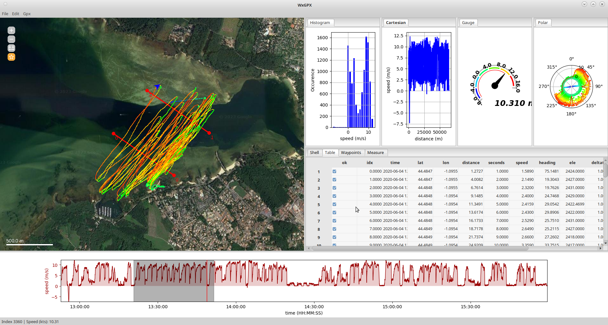

[TOC]
# INTRODUCTION
A software to display and analyse gpx anf fit gps tracks. wxgpx2 is a partial rewrite of wxgpx-phoenix, which is  no longer maintained.


# LICENSE

wxGPGPSport is distributed under the MIT public license. A copy of the MIT public license is bundled in the application.  
wxGPGPSport includes 3rd party libraries (smokesignal, fitparse) which may not be in sync with original repos

# INSTALLATION

## Requirements

wxGPGPSport should run with any recent python (3.7+) interpreter.  
wxGPGPSport requires the following modules:  

- numpy, pandas, matplotlib
- requests
- wxPython
- Pillow

On linux platform, all required packages can be installed using you package manager (synaptic for debian, yumex or dnf for fedora).  
On windows and OSX platform, all required modules (see next paragraph) can be installed through pip.  
On OsX plattform, the program used to work, but this newer version has not been tested yet.

`py -m pip install package_name`

## conda virtual env
If you have a conda environnement setup, you should be able to create a virtual env suitable to run program using the command.  
`conda create -n wxgpx matplotlib numpy pandas requests pillow wxpython` 

## Pyinstaller packages

Binary packages for windows are available in the release section.

# BRIEF MANUAL

## Getting started

At startup, the software window is divided into 3 main panels:  

- The top left panel (map panel) shows a view of the earth.  
- The bottom panel (time panel) should be empty.  
- The top right panel (plugin notebook) displays a notebook where a variety of plugins can display additional data computed from current file.  
- The status bar will display information about the current point.

## Opening a file

- Using the menu (File->Open), you'll get a file selection dialog box where you can browse to the file you want to open.

- you can also directly drop your files on map or time graph
- The program can read :
  - gpx files v1.0 (\*.gpx)
  - Garmin fit files (\*.fit)
  - csv or tsv files with the columns 'time',lat',lon'
- If no information is found concerning speed in the file, the speed is calculated according to GPS positions and time. Some other information (heading,displacement, etc...) are calculated by the software and everything is stored in a table (to learn more about this table, see plugins section, table and shell).
- Most tracks have (few) missing points. If any, the program will propose to genearte missing data using linar interpolation or cubic spline interpolation if scipy is installed

## Using the map panel

- The map panel displays the trace using false colors (red=very fast, blue=very slow). The background is dynamically fetched from various tile servers.

- A palette of tools is displayed in the upper left corner. The active tool determines which layer will handle mouse clicks and keyboard events. if no tool is selected, then mouse clicks are handled by the global map object
- You can zoom in and out using the mouse wheel.
- You can translate using the mouse (left click+drag)
- You can right click on the map and choose an alternate map tile provider (some of them may not be working). The default provider is google maps. It is possible to load tiles from google satellite, but you have to know that accessing these tiles outside the dedicated google api is illegal!
- When you move the mouse, an indicator (blue arrowhead by default) will indicate the current point (trace point closest to mouse pointer). The position of the cursor is updated in time panel (see below).

- You can customize the information displayed on map by double clicking on the map. A dialog will appear with several options:
  - Key for latitude: 'lat', unless you are not deealing with track1 layer 1
  - Key for longitude: 'lon', unless you are not deealing with track1 layer 1
  - Key for color: key to use for false colors track representation. False colors vary from blue (for minimum) to red (for maximum). If you do not want false colors, you may enter the hexadecimal representation of the colour ("#RRGGBB"), or None.
  - Line width: width of line used to display gps track and current indicator. Default is 2.  
  - Key for vector angle: key to use (degrees) for vector angular data. (usually apparent wind absolute direction)
  - Key for vector norm: the key to use for vector norm data. (usually apparent wind speed)
  - Vector scale: the maximal length (in pixels) of the plotted vector
  - Tracker color: the color to use to draw tracker.

Currently, the colormap can only be modified through the shell plugin (see shell).

## Using the time panel

- The time panel displays a graph where speed (by default) is plotted against time (by default).  

- The mouse wheel on X- and Y- axis enables you to zoom at some specific portion of the curve (it may be necessary to click on the panel in order to give focuss to this panel).  
- Left click+drag on X- and Y- axis moves the area represented.  
- Right click-drag on X- and Y- axis scales the area represented.  
- Double click on graph to choose graph parameters. Most parameters should be pretty self-explanatory. You can plot up to 2 overlapping graphs with same X-axis. X axis values have to be incrementing (choose one of time, idx, distance)
- When you move the mouse, the vertical cursor (red) moves to follow the mouse. On map panel, the current position (green arrowhead by default) will follow the position of the cursor. some plugins (e.g gauge) will also follow this position.
- You can select a small range of data by using left click+drag in time panel curve. The selected area will appear grey.  
- Using right click, you can enable/disable the selected points (or the non-selected points). Once a selection is disabled, all panels are updated (including plugins) and all calculations in plugins are restricted to selected datas.  
- Use left click (without drag) to empty selection.  
  
### Using the status bar

The status bar displays whatever information you find usefull. In order to customiaze the display, double click on the status bar and enter the text you want to display.
Any word enclosed between % signs will be replaced by current value of this field. Fo exemple, to display index, speed and ele, you'd use the formatstring:
`Index : %idx% Speed (knots): %speed% Altitude (m): %ele%`  

## Saving files

- WxGPGPSport can save files as gpx (*.gpx) files, tsv (*.tsv, *.tsv.gz) oc csv (*.csv,*.csv.gz) files.  

- The file saving format is determined by the filename extension

## Using replay

- You can replay the enabled part of the trace using GPX->replay menu. The Replay speed is an arbitrary number representing the interval between two time points, in ms.

- You can stop the replay by re-selecting the menu GPX->replay
- During replay, moving the mouse cursor wil not update the current index.

# PLUGINS AND SCRIPTS

- The program uses a simple plugin architecture. There is currently no option in the program to select which plugins are loaded. If you want to disable some plugins, just add an underscore to the name of the appropriate '*.py' file in plugins directory.  
- Plugin tabs can be moved to reorder them, but they can also be docked on the side of the window so that several plugins can be displayed at the same time.  
- Plugins cannot be moved outside the plugin panel.
- Plugins with graphs can be zoomed / Pan with mouse.
- Some plugins can be conigured by couble clicking on panel.

## Plugins

### ScatterPlot plugin

The scatterplot plugin is mostly similar to time view, except that you are not limited to time/distance regarding X axis.

- Double click on graph to decide what to plot and how to plot.
- Zoom and pan controls are the same than in time panel.

### Histogram plugin

Identical to scatterplot plugin, except that it displays an histogram instead of an XY plot.

### Polar plot plugin

Identical to scatterplot plugin, except that it displays an data in polar coordinates instead of cartesian coordinates. Mainly usefull for sailing activities.

- Double click on graph to set up plot parameters.
- Use mouse wheel to zoom unzoom.
- The plugin can also display an enveloppe of points.

### Gauge plugin

The gauge plugins display in real time one of the parameters choosen among available data (see table plugin).

- Double click on graph to customize display.
  
### Table plugin

THe table plugin dispalys a table view of yout track. A typical usage of the table plugin is to disable or correct abnormal points (speed to high, ...)  

- The 'ok' column with checkbox corresponds to enabled/disabled points.
- The table can be sorted according to one column by right clicking on column header and selecting appropriate option. Be carefull that the program may crash if you delete a required column.
- Rows can be enables/disabled by selecting them and right clicking in row numbers and selecting the appropriate option.
- You ~~may~~ will experience some bugs...The plugin is not thoroughfully tested.
- It is not possible to delete points from table plugin. you **must** use the time view for deletion operations.
  
### Measurement plugin

The measurement plugin can be used to measure the width and height of the entire map panel. To use this plugin, you'll need to activate the measure layer in the map panel (third button from top on left of map panel).  

- Left click to add points to default path. The path is drawn on map and its length is automatically updated in the measure plugin panel.  
- Right click on point to remove points from path.
- Deactivate measure layer to stop recording points.  
  
***Note:*** all measurements for this plugin are in meters and degrees. The plugin does not take into account the user specified units.
  
### Waypoints plugin

- The waypoints plugin can be used to select only parts of the track based on specific waypoints, also called “doors” or "gates" (like in a ski slalom). In order to use the waypoints plugin, you have to use the waypoints tool on the map (the star icon). More info is available in the TUTORIAL.md file.

- You can draw directly the gates (waypoints) on the map by left clicking then dragging the mouse to define two points. A waypoint is passed each time the track crosses the segment defined by the waypoint.
- You can remove waypoints by right clicking on the dots that materialize the waypoints.
- Each time you add a waypoint, the list of waypoint is updated in that waypoints panel
- Saving and loading gates can be done through load and save buttons...Files are saved in pickle format.

### Shell plugin

- The shell plugin is simply a python shell that gives you access to the internals of the program. Using the shell plugin, you can manipulate your gps track as you want, but also customize the program behavior

- The table holding all datas is a pandas.DataFrame that can be accessed through the gpx variable.
- The column ok in this table holds the enabled/disabled status of datapoints
- The data are returned in SI units (remember that wxGPGPSPort only works in SI units, then converts to user defined units).
- The special accessor .unit gives you access to units information for each serie of measurements:  

```python
gpx.speed             # unscaled values of speed, m/s
gps.speed.unit.scaled # speed converted to user units
gps.speed.unit.sym    # symbol for unit used , kts or m/s or km/h
gps.speed.unit.legend # label (ifs unit is knots, returns 'speed (kts)'
```

#### Exemples

- you can easily access the individual table columns using the following syntax:

```python
gpx['speed'], gpk.speed      # gives all speeds unscaled (m/s) 
gpx['lat'][0], gpx.lat[0]    # latitude of the first point in file
gpx.speed[gpx.ok].mean()     # mean speed for enabled points, m/s  
```

- Calculate the average speed for points above 3m/s:

```python
gpx.speed[gpx.speed>3].mean() 
```

- Selecting only points where speed is above 10km/h:

```python
gpx['ok']=gpx.speed*3.6>10
## or, if you've set speed units to km/h
gpx['ok']=gpx.speed.unit.scaled>10
```

- Creating and deleting new columns:  
You can create an extra column in the table and manipulate its values by providing its name. Note that inserting,deleting (and myabe sorting) column may cause loss of column metadatas (presently units). you can save and restore this data using attrs_save and attrs_load.  

```python
gpx['accel']=np.ediff1d(gpx.speed,to_end=np.nan)
gpx.drop(columns=['accel'],inplace=True)
```

- You can write all your instructions in a script then run the script using “run the script file below…” button in shell plugin.  
- In order to import functions from other scripts, you have to keep the file `__init__.py` in the scripts folder.  
- Any script file starting with "_" or "lib" will be excluded from script list.
- The script module gives you access to the following objects/commands:

```python
gpx         # main dataframe
mapview     # the map panel object. 
timeview    # the time panel
app         # the application itself. mainly for app.OpenFile(filename) and app.SaveFile(filename)
sh          # the shell by itself. Usefull commands may include sh.clear() to clear the shell, sh.run(filename) to run an external python file, sh.copy(text) to put text in the clipboard, and sh.msg() to force an update of map, time and plugin panels
appdir      # main app directory
scriptdir   # script directory
plugindir   # plugin directory
WxQuery     # also available as query; access to simple gui    (see the moule WxQuery in modules folder)
```

- The global objects may not be available if you try to import a script file.  
For script files that define usefull functions ("libxxx.py"), you can gain access to functions using sh.run("libxxx.py").

- Whenever you alter the data through shell or script, you must informa other panles and plugins. This can be done with the following commands:

```python
## minimal version
sync()
## short versions
msgidx(newidx)
msgsel()
msgdata()
## long versions
mswgwrap.message("INDEX_CHANGED", emitter=sh,idx=newidx)
mswgwrap.message("SELECTION_CHANGED", emitter=sh)
mswgwrap.message("INDEX_CHANGED", emitter=sh)
```

## Scripts

Scripts are accessed from the shell plugin. Any script in scripts/ folder starting with "_" or 'lib' will not be reported in shell plugin script menu.  
The script folder contains the following files:  

- **libwayptutils.py**
Contains function to load and save waypoints (or measurements)

```python
>>>sh.run("libwayptutils.py")
>>>savegates()
>>>loadgates([(3.1235,4.1235),(lat1,lon1),(lat2,lon2)])
## in order to permanently save/load to file
>>>import pickle
>>>pickle.dump(savegates(),open("mygates.pkl","wb"))
>>>loadgates(pickle.load(open("mygates.pkl","rb")))
```

The same functions may be used to load/save the measurements points by passing the 'layer="measure"' parameter.

```python
>>>savegates(layer="measure")
>>>loadgates(gates,layer="measure")
```

- **VMG**
Computes the VMG and apparent wind from boat speed, boat heading and user provided wind strength (same units as boat speed) and direction. The script creates the new entries in gpx.DataFrame:  
-- awar : apparent wind angle (degrees), relative to boat course.  
-- awaa : apparent wind absolute angle (degrees), relative to North (0).  
-- aws : apparent wind speed (same unit as boat speed).  
-- uwa : upwind angle (degrees). 0 is frontwind, 180 is tailwind.  
-- vmg : velocity made good (same units as boat speed).  

- **Windsurf_statistics**
Computes some basic statistics about my windsurf sessiions.

- **Windsurf_bestruns.py**  
Computes and dumps some information about best 5s, 10s 30s 500m runs.

- **Windsurf_alpha.py**  
Computes the alpha250-500 or 1000 speed.

- **Windsurf_units**  
Will set speed units (speed, vmg, etc..) to knots and distance units to km.

- **Split_gpx_tracks**  
Splits gpx files with multiple tracks in multiple independant gpx files.

- **Import**
Imports and merges additional gpx tracks with currently opened file. This enabled displaying several tracks on the map/graphs.
supports several join styles:  
++ 'innner' keeps only the kommon time stamps
++ 'outer'  extends the current file to keep all timestamps (including new ones)
++ 'keep'   keeps the current time range
++ 'async'  recreates fake time ranges. Assumes that first point in each track is synchronous.

- **Cycling_units**  
Will set speed units to km/h and distance units to km.  

- **Cycling_statistics**  
Computes some basic statistics about cycling session. Currently does not compute total ascend/descend, but should be easy to implement.

## Internals

The internal columns used for calculation in table are listed below: do not modify these columns!!.

```python
ok          # is point marked as valid or not?
time        # time of recording. if absent from gpx file, will be automatically generated
seconds     # time in seconds since beginning of recordings
lat         # latitude
lon         # longitude
idx         # the index of point in file. Usefull for scripting
deltat      # interval (s) between two consecutive points
deltaxy     # distance (m) between two consecutive points; calculated from lat,lon
heading     # course (in degrees); calculated from lat,lon
speed       # speed. If not found in file, speed is calculated from position and time
distance    # cumulative distance. if not found in file, uses the cumulative sum of deltaxy
```

Other columns imported from gps/fit file may include:

```python
ele             # elevation data (altitude)
magvar          # magnetic orientation of gps
hr/heartrate    # heart rate
cadence         # cadence,for cycling activities
power           # power
temp            # temperature
```

## Advanced script/shell usage

### Loading different tracks from the same gpx file

```python
gpxdata=app.frame.OpenFile("my_gpx_file.gpx",trkname=f"track_1", resample='auto')
app.frame.AttachGpx(dpxdata)
sync()
```

### Merging different files to display several tracks

(supposes that times overlap more or less)

```python
allfiles=["first_track.gpx", "second_track.gpx","last_track.gpx"]
gpxs=[app.frame.OpenFile(filename,
                        resample="1s").set_index('time') for filename in allfiles]
refgpx=gpxs[0]
for e,g in enumerate(gpxs):
    for k in ['lat','lon','speed','heading']
        refgpx[k+str(e+1)]=g[k]
refgpx.fillna(method='bfill',inplace=True)
refgpx.fillna(method='ffill',inplace=True)
refgpx.reset_index(inplace=True)
savegpxfile(refgpx,"test.gpx")
```

Then, in Time view and/or plugins, select the features from other tracks you want to display, or decide to show extra tracks on map (see next paragraph).

### Displaying additional track layers

This supposes that you have already merged some tracks (see previous code). Note that the name of the extra track(s) has to start with "track".

```python
from WxMapPanel import *
mapview.map.layers["track2"]=PdPathLayer(mapview.map,gpx, linewidth=2, dotsize=0.0)
```

Then, double click on map panel, select track2, then select appropriate columns for lat, lon, color and heading. (bare minimum).
***Note***: *adding tracks can now be done through the map interface.

### Saving and loading gates (or measure path)

For waypoint plugin:

```python
sh.run("libwayptutils.py")
import pickle
## to save gates
pickle.dump(savegates(), open("mygates.pkl", "wb"))
## to load gates
loadgates(pickle.load(open("mygates.pkl", "rb")))
```

For measure plugin:

```python
sh.run("libwayptutils.py")
import pickle
## to save gates
pickle.dump(savegates(layer='measure'), open("mygates.pkl", "wb"))
## to load gates
loadgates(pickle.load(open("mygates.pkl", "rb")), layer='measure')
```

# NOTES

The code to load plugins can also work in the frozen version (provided you copy the plugins folder to frozen app root folder).
In order to get the plugins to work, the following extra modules are imported by pyinstaller.

```python
from wx.py import shell
import  wx.grid
```

If you want to develop plugins that need to import extra python modules, you'll have to install a full python environment (in any case, installing a full environnement is better to develop plugins and scripts).
