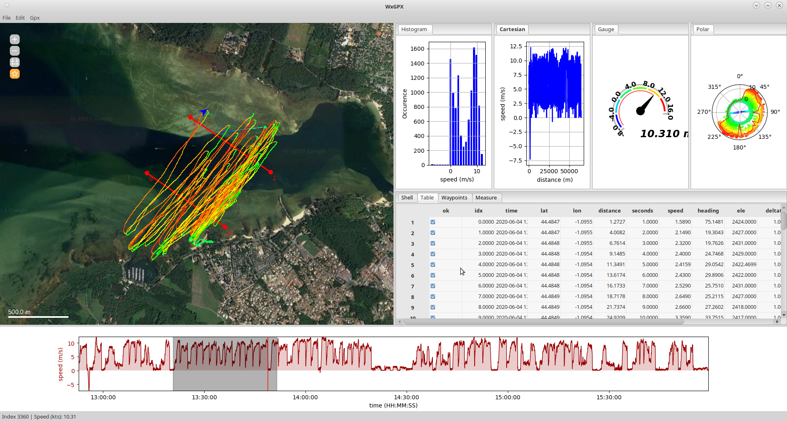
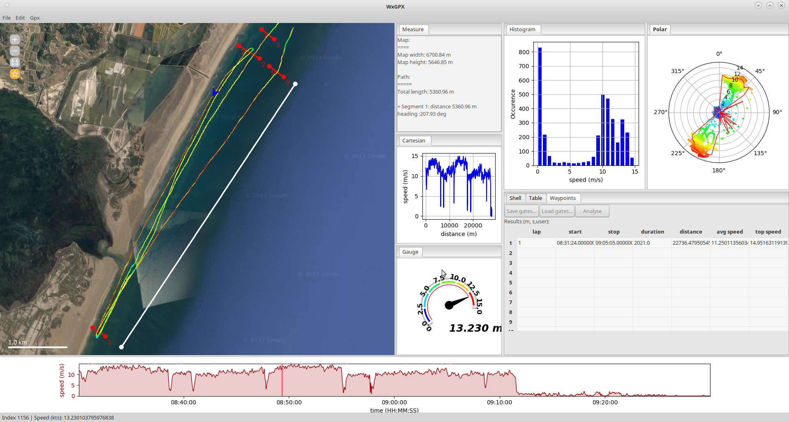
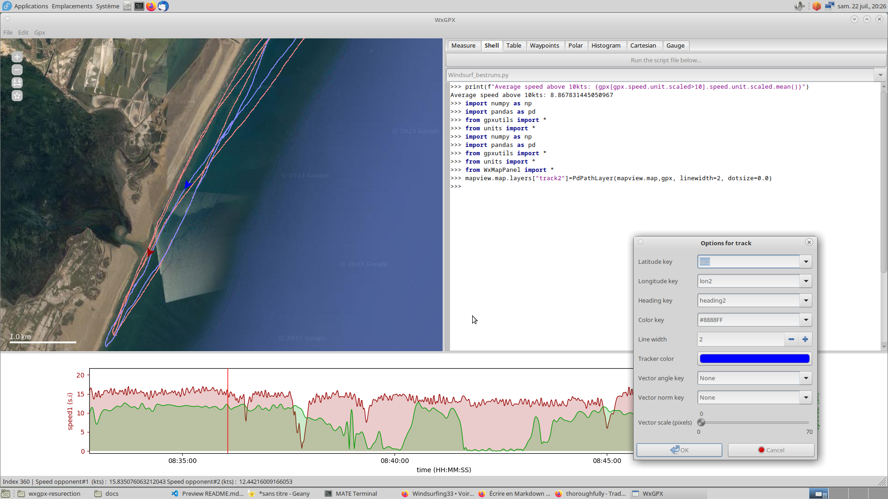
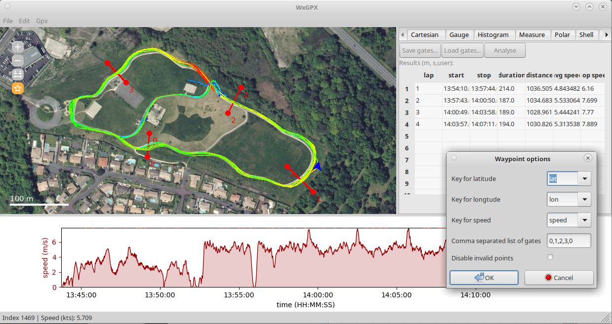

[TOC]
# SCREENSHOTS).   
Windsurf:

Defi wind:

Dual track:

Roller skate:


# BEFORE ANYTHING.
At program startup, you'll find a window with several panels.

## Map panel.
This is where the gpx/fit recorded tracks will be displayed. Interacting with this panel is easy:
- mouse wheel to zoom in / zoom out (or use top left buttons "+" and "-")
- left click and drag to move map
- right click to display contextual menu.  
  -- *Map source->Provider*: use specified tile provider for map background (as specified in settings file).  
  -- *Actions->Force refresh*: refresh currently displayed tiles.  
  -- *Actions->Clear cache*: destroy all tiles in cache.  
  -- *Actions->Prefetch*: download all tiles for next 2 zoom levels.  
  
The map panel displays two additional tool buttons. When the buttons are clicked, they activate specific "layers" of map panel.  
Click on "measure" button (third from top), then click at some random potitions on map. A path gets drawn.
- left click adds a point to the path
- right click on a point to remove point.

Click again on measure button to stop recording path. 
In order to view the properties of your path, go to the "Measure" tab on the right side panel. This tab (a plugin) will show you the properties of the map (width x height) and the properties of your path segents (length, heading). The tab is updated each time the path changes.  

## Time panel.
The time panel (bottom) displays some information as a function of time, distance, or point index. Is is empty at startup.

## Plugin panel
The plugin panel display various information and enables advanced interaction with data. Most tabs within plugins panel will be empty at startup.

# Tutorial 1: WINDSURF session.
Our first tutorial is gonna take us through a windsurf session, present in "data/windsurf.gpx".
## Opening the file. 
Start the program and select File->Open. Using the dialog, select the file "windsurf.gpx" in data folder. Most likely, the program will complain that there are some missing points and will propose to resample. It is recommended (but not mandatory) to accept.  
***Note 1:*** *The program can open natively .gpx files and garmin .fit files. It can also open any .csv or .tsv file saved by program (with at least a time, lat and lon columns). To open any other format, you'll need to convert them to .gpx with GPSBabel.*  
***Note 2:*** *The program will always load the first track of gpx file. If several tracks are present in a gpx file and you want to load a different one, you'll have to use the shell plugin.*  
***Note 3:*** *The program expects regularly sampled data (ideally every 1s). If sampling interval is variable, the program can resample your datafile based on shortest interval. The program also expects timestamps to be aligned to seconds and the behavior is undetermined for faster acquisition (could not get relevant file to test).*  
***Note 4:*** *There are several reasons for missing points: some GPS recorders try to save space by skipping points when position and speed does not change. More often, there may be missing points at the beginning of the track, when the device is trying to lock on the satellites.*

**If the file loaded succesfully,**  
- The map panel should be centered on gpx track location. 
- The time panel (on the bottom) should display the speed as a function of time. 
- While moving your mouse on the time panel or on the map panel, you should see a cursor moving on the time panel and an arrowhead moving on the map. The arrowhead is headed towards front. 
- Both arrowhead on map panel and cursor on time panel are synchronized.  

## Exploring files.
The Table tab (on the plugin panel) shows a detailed view of the Dataframe (~ spreadsheet) used for internal storage. Upon loading a file, the program will
+ look in configuration file (*"wxgpx_settings.json"*, *"transtable"* section) for name of fields to discard and name of fields to translate. You may therefore end up with different names from what you usually see with other software.  
+ calculate some extra fields required for internal caclulations. The extra fields are:  
-- ok: whether the point is enabled or disable.  
-- idx: index of point in file (starting at 0).  
-- distance: cumulative distance since start of recording.  
-- seconds: elapsed time in seconds since start of recordings.  
-- speed: if no speed is present in original file, this is the calculated speed. Otherwise original data is kept.    
-- heading: in degrees (North is 0, clockwise).  
-- deltat: elapsed time between two points.  
-- deltaxy: distance travelled since last point.  
-- deltaz: difference in elevation (if 'ele' is present).  
-- ascspeed: ascending speed (if 'ele' is present).  

***Note 1:*** *The program expects these values to be present and may crash if you delete these columns.*  
***Note 2:*** *Some GPS devices may propose several fields for 'speed' (mine proposes 'ball_speed' and 'enhanced_speed'). You need to play with wxgpx_settings.json file in order to decide which you will keep, and which one you will discard.*   

## Playing with views.
### Map panel.
Double click on map panel. A dialog will appear prompting you to select the track to tune (in 99% of cases, you'll only have one track). CLick "OK". The next dialog will offer you to tune layer settings.
- Latitude key should be 'lat' in 99.9% of cases.
- Longitude key should be 'lon' in 99% of cases.  
- Heading key key should be 'heading' in 99% of cases.  
- Color key can be any value from dropdown menu (usually speed, but could use 'ele' (altitude), 'hr' (heart rate), 'cad' (cadence), depending on what data available in your gps track). You can have monochrome track by entering an hexadecimal color specification (#RRGGBB). For exemple, pure red is '#FF0000', pure green is '#00FF00'...
- Line width will ususally be 1 to 4-5.
- Tracker color specifies the color to use for tracker.
- *Vector angle key, Vector angle norm and Vector scale will be explained later in tutorial(see advanced analysis).*
  
### Time panel.
Double click on time panel. A dialog will appear to customize the graphs. Most options should be self explanatory. The "Smooth" slider is used to smooth (local average) your data. By default, only one graph is presented (the speed), but you can select any data provided in your gps track for graph 1 and 2. 
The X and Y axis of the superposed graphs can be zomed with mouse:
- Use mouse wheel in X or Y axis to zoom in/zoom out a specific axis
- Use left click+drag in X or Y axis to move (pan) the region of interest
- Use right click+drag in X or Y axis to zoom in/zoom out (same as wheel)

You can select specific portions of the track using left click+drag on data area. Once you have selected some portion of the track, right click on the data area to enable/disable specific parts of the track.
- Enable/Disable/Toggle points will enable or disable points. Enable/disable operations are symetrical and can be undone using 'Enable all' menu
- Delete points is definitive and cannot be undone (you'll need to reload your file). Changes are **not** saved to disk unless you specifically ask to (File->Save as).  
  
***Note :*** *Most calculations are done on enabled points only.*
### Status bar.
The status bar displays whatever information you find usefull. In order to customiaze the display, double click on the status bar and enter the text you want to display.
Any word enclosed between % signs will be replaced by current value of this field. Fo exemple, to display index, speed and ele, you'd use the formatstring:
`Index : %idx% Speed (m/s): %speed% Altitude (m): %ele%`

### Plugins.
Plugin display various information on the current track. Most ot them should be self explanatory (except for shell and waypoints)
#### Cartesian plot.
This plugins display a cartesian plot. It behaves mainly the same as time view, except that it is not dynamic (i.e no cursor) (mouse wheel, right and left click on axes to zoom in/zoom out, double click to open settings window). Unlike the time panel, you may use any data for X axis.  
#### Histogram plot.
Mostly identical to Cartesian plot, except that it displays an histogram instead of a cartesain plot.  
#### Polar plot.
The polar plot plugin displays a polar graph, where the two variables are the angle (theta, clockwise, North at 0) and the radius. The default is to display boat heading as angle and boat speed as radius. There is an option to display the envelope of the points using various metrics. This plugin is most usefull to visualize up/downwind VMG in sailing activities (see analysing data).   
***Tips :*** *you can hide points on graph and show only enveloppe by specifiying 0 as dot size.*  
***Tips :*** *the extra arguments field (experts only) is used to pass additional arguments to matplotlib backend.*
#### Gauge plugin.
The gauge displays an animated plot of a speed gauge. Double click on panel to tune settings (not heavily tested).  
#### Table plugin.
Shows the current file as a spreadsheet like table. This speadsheet can be used to sort points according to a specific column, enable disable points, and modify their value. The data is displayed in user units adn automatically converted back to S.I (remember that interally, the program works in SI). You delete specific columns (for exemple, before exporting files) or append new columns (less usefull).  
***Caution :*** *modifying values in this table may induce dangerous side effects. You should not modify 'time', 'idx', 'seconds' and 'deltat'. Other fields **may** be safe to modify, although this could produce strange results. A reasonable use case is to modify abnormal 'speed', 'ele' or 'bpm' values.*  
#### Measure plugin.
Displays the size of current map area and the length of the current user-drawn path (if any). More info in section "Before anything/map panel"
#### Waypoint plugin.
Enables the analysis of virtual races. see later in the this file.


## Analysing data.
### Setting correct units.
The program works with units meters, seconds, and degrees (clockwise). All calculations are done using unscaled values. You can choose, however, to **display** final values using the units of your choice.  
Using the Gpx->Units menu, check that the unit for speed is kts (knots) and the unit for distance is m (or km). When you close the dialog, the program should reflect your changes (amy take some time), both in time panel and plugins.  
Default units can be saved in file wxgpx_settings.json, section "units"

### Removing spikes in data.
GPS tracks will sometimes contain abnormal values (specifically for speed, either due to measurement errors or due to loss of signal. In windsurf & winfoil, crashes with important acceleration may also lead to erroneous points)
The sample track here has one erroneous point at ~14:22:45. The status bar indicates the index of the point (5397) when you mose moves over the point in time view.  

In order to **remove** that point, you could: 

*Using time panel:*  
+ zoom on track using mouse wheel,  
+ select the invalid points (left click+drag), then right clic and select "Disable selected"

*Using the table plugin panel:** 
+ sort point by speed, descending (right click on 'speed' column).   
+ disable the first point.  
-- either by clicking on checkbox.  
-- or by selecting rows, right clicking in selected row numbers and selecting "Disable selected". 
* sort points by speed, ascending (same as before)
* disable the first point (should have negative speed value) 
+ sort points by time, ascending (to go back to original presentation).   
 
***Note:*** *you could also direcly scroll to line ~5397 in table, and disable abnormal points points. Note that there is a 1 unit shift between row numbers displayed in table and real point indices (displayed by status bar, available in 'idx' column)*  

In order to **correct** that point, you could:  
*Using the table panel:*
+ sort points by speed, descending.
+ correct value in first cell of column 'speed'.
+ sort points by time, ascending. 
+ (or go directly to row 5397 and correct speed value for this row) 
  
### Getting some usefull statiscics.
There are a few ready to use scripts in the scripts folder. To use them, you must go to the shell plugin. The popup menu lets you select the the script to run. Just click on run to start the script.
Most scripts expect that your track points are sampled at fixed intervals. Some expect that them sampling interval will be 1Hz (one point every second).  
#### Windsurf_statistics:
Gives you some basic statistics about your windsurf session. The result is displayed in shell window but it is intended to be pasted in a spreadseet.  
***Note:*** *Best 10s is in fact best 10 points average (in case your GPS does not sample at 1Hz).*
```text
Date                :2020 06 04
Time                :12 52 47
Avg Speed (kts)     :10.989712394614289
Distance (m)        :64053.58313360638
Duration (s)        :3:06:40
Avg speed(>10kts)   :17.233888365016284
Distance (>10kts)   :54576.76980494677
Duration (>10kts)   :1:42:20
VMax (kts)          :23.90728816
Best 10s (kts)      :23.136166832
Best 500m (s)       :43.0
```
#### Windsurf_bestruns:
Gives you some information on the best 5s 10s,30s and 500m runs.  
***Note:*** *this script supposes that you use time based recoding with 1Hz frequency.
```text
Best 5s runs (time,avg speed):
('14:57:34', 23.503358208)
('14:50:00', 23.406943744000003)
('12:58:01', 23.305086528)
('14:05:22', 23.254935456000002)
('14:05:10', 23.029061247999998)

Best 10s runs (time,avg speed):
('14:49:59', 23.136166832)
('12:58:00', 23.012149840000003)
('14:05:19', 22.949558192000005)
('14:01:32', 22.862085392000004)
('14:57:36', 22.754979808)

Best 30s runs (time,avg speed):
('14:05:10', 22.80603800533333)
('14:01:22', 22.161881826666665)
('14:05:52', 22.100769656888897)
('14:57:45', 21.824657983999995)
('13:57:31', 21.625543973333333)

Best 500m runs:
14:04:51 to 14:05:34 || Duration: 43.0 | Speed : 22.645805875520505 | Distance: 500.9515457277254
14:00:52 to 14:01:37 || Duration: 45.0 | Speed : 21.87801588893903 | Distance: 506.47723835411165
13:57:01 to 13:57:47 || Duration: 46.0 | Speed : 21.21844641248098 | Distance: 502.1239067897178
13:58:31 to 13:59:17 || Duration: 46.0 | Speed : 21.18513477571782 | Distance: 501.33560359032623
14:49:17 to 14:50:04 || Duration: 47.0 | Speed : 20.915440184008403 | Distance: 505.71327303090527
```
#### Windsurf_alpha:
Alpha250 (respectively 500 and 1000) is the average speed in the 125 (resp 250 and 500) meters before and after jibe.   
In order to use the script, you must enable the region you want to analyse (the region can enclose many jibes, but it has to be clean,without crash or rest, etc...), and disable remaining regions.  
For instance, with region highlighted on screenshot "Windsurf".
```text
jibe   0 (13:22:46): alpha250 (kts): 12.870, vmin (kts):  5.015
jibe   1 (13:25:02): alpha250 (kts):  8.225, vmin (kts):  1.242
jibe   2 (13:27:38): alpha250 (kts): 14.159, vmin (kts):  3.907
jibe   3 (13:29:32): alpha250 (kts): 13.715, vmin (kts):  4.510
jibe   4 (13:31:29): alpha250 (kts): 11.936, vmin (kts):  4.158
jibe   5 (13:33:34): alpha250 (kts): 12.397, vmin (kts):  3.458
jibe   6 (13:36:08): alpha250 (kts): 11.915, vmin (kts):  3.419
jibe   7 (13:38:16): alpha250 (kts):  9.257, vmin (kts):  2.955
jibe   8 (13:40:30): alpha250 (kts): 14.272, vmin (kts):  2.994
jibe   9 (13:42:08): alpha250 (kts): 11.177, vmin (kts):  2.955
jibe  10 (13:44:21): alpha250 (kts): 13.579, vmin (kts):  2.838
jibe  11 (13:46:19): alpha250 (kts): 12.289, vmin (kts):  2.894
```
#### VMG
Computes the Apparent Wind and Velocity made good, i.e the projection of the speed vector on the wind vector. The script will ask you the wind direction (this is the direction the wind is going to: west wind is 90°, North wind is 180°, etc), the wind speed (*same unit as boat speed*), and the columns with boat speed (speed) and direction (heading).  
The script adds 5 columns to the gpx dataframe:
+ awar: apparent wind angle relative, relative to boat
+ awaa: apparent wind angle absolute, relative to North (0°, clockwise)
+ aws:  apparent wind speed. same utit as boat speed 
+ vmg:  velocity made good, same units as boat speed
+ uwa:  upwind angle. 0 is facing wind, 180 is tailwind.  
  
After running this script, you'll be able to display some polar graph of VMG using polar plugin, with 'uwa' for angle and 'vmg' for radius.  
After running this script, you'll be able to display apparent wind on map by double clicking and selecting 'awaa' for vector angle key, 'aws' for vector norm key, and 70 for vector scale.

### Using the waypoint plugin to compare runs.
The waypoint plugin can be used to define virtual gates (for a sailing activity, one would speak of virtual buoy), which are specific marks to isolate parts of you data.  
**using the waypoint tool on map panel:**  
+ Click to define gates accross trajectories and an arrival line (see attached picture).  
+ Click the checkbox disable non relevant points (or not...).   
+ Click analyse button.  
-- In the popup  window, enter the gates in the order they should be crossed. If your trajectory crosses twice the same gate in a run, you must enter the gate twice (for exemple, on screenshot "defi.png", the order of gates should be 0,1,1,2,2,1,1,2,3).  
-- most of the time, you should stick to lat, lon and speed for the keys (unless you have multiple tracks in the same file)
+ The program will isolate all segments between first and last gate. If you want to make a loop (departure and arrival being the same, you'll have to enter the first gate at beginning and end of yous sequence.)
  
The plugin works by controlling intersections between track and gates. If you have two gates (0,1)(2,3), the program will isolate track segments crossing all gates in specified order.  
***Note 1:*** *if arrival is the same as departure, you must speficy the gate twice.*   
***Note 2:*** *all gates must be crosed in correct order. If the track crosses twice the same gate, you'll need to enter the gate twice in the text field specifying gates.  
***Note 3:*** *gates can be saved and loaded using the following commands (in shell plugin)
```python
sh.run("libwayptutils.py")
import pickle
## to save gates
pickle.dump(savegates(), open("mygates.pkl", "wb"))
## to load gates
loadgates(pickle.load(open("mygates.pkl", "rb")))
```

  
### Using the shell plugin to get additional info.
The shell plugin can be used to manipulate the gpx dataframe, manipulate program state, plot additional data interactively from shell, or run scripts (as we've seen previously).  
In order to inform map, time and plugin panels that data has changed, you must use the sync() command which will update all panels.
Here are some usefull commands
+ compute average speed, unscaled (i.e m/s)  
`gpx.speed.mean()`
+ compute median speed, scaled (i.e m/s), for enabled points  
`gpx.speed.unit.scaled[gpx.ok].mean()`
+ smooth elevation data (5 points running average - required elevation data)  
`gpx['ele_smoothed']=np.convolve(gpx.ele,np.ones(5)/5,mode='same')`  
alternate formulation:  
`gpx['ele_smoothed']=gpx.ele.rolling(5, min_periods=1).mean()`
+ compute acceleration:  
`gpx['accel']=np.gradient(np.convolve(gpx.speed,np.ones(5)/5,mode='same'))/gpx.deltat`  
+ disable points within a specific range:   
`gpx['ok'][4520:4525]=False`
+ disable all points where speed is above 20kts, and enable the rest:  
`gpx['ok'][:]=gpx.speed.unit.scaled<20`
+ compute slope (requires elevation data)  
`gpx['slope']=np.gradient(np.convolve(gpx.ele,np.ones(5)/5, mode='same')/gpx.deltaxy)`  
+ go faster (warning: cheat is easy to detect!)  
`gpx['speed'][:]=gpx.speed*1.2`
+ remove points above 35 knots, and replace by an interpolation
`gpx.speed[gpx.speed.unit.scaled>35]=np.nan`  
`gpx['speed'].interpolate(method='linear',inplace=True)`

***Note :*** *some operations may lead to a loss of unit information! Be carefull!. A workaround (for now) is to save the units and restore them. Saving units and restoring units can be done with the following functions:*
```python
savedunits=attrs_save(gpx)
attrs_load(gpx,saved_units)
```
*As an alternative, there is a script called Windsurf_units.py that will take care of restoring correct units for you.*
